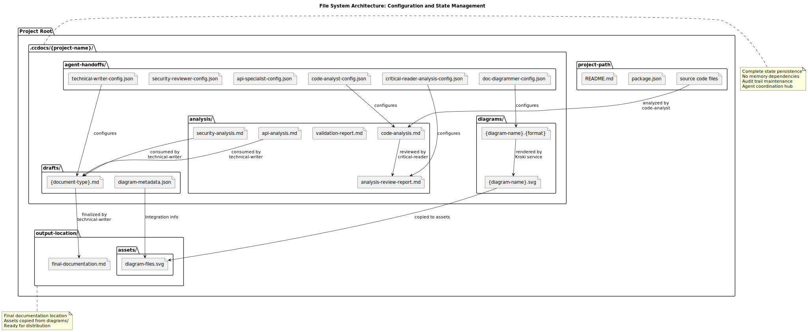

# Architecture Overview: Multi-Agent Documentation Generation Framework

> A sophisticated Claude Code CLI-based system that orchestrates specialized agents to generate comprehensive technical documentation through source-code-only analysis with iterative quality validation.

## Features

- **Multi-Agent Orchestration**: Coordinate specialized agents (analysis, writing, security, API, diagrams) through native Claude Code CLI Task() system
- **Source-Code-First Analysis**: Strict adherence to actual code examination rather than documentation assumptions
- **Iterative Quality Gates**: Built-in correction cycles with critical-reader validation ensure accuracy
- **Extensible Agent Architecture**: Clear separation of concerns with configuration-driven handoffs
- **External Service Integration**: Dual-endpoint Kroki integration for professional diagram generation
- **Comprehensive Error Recovery**: Robust error handling with automatic retry and graceful degradation

## Quick Start

### Prerequisites

- Claude Code CLI installed and configured
- File system write permissions for `.ccdocs/` directory creation
- Optional: Local Kroki service for diagram generation (recommended for sensitive projects)

### Basic Usage

```bash
# Generate comprehensive documentation for your project
/docs:generate [project-path] [--docs-location path] [--format markdown|html] [--diagrams]
```

### Minimal Working Example

```bash
# Generate documentation for current project
/docs:generate .

# Generate with diagrams for specific documentation location
/docs:generate /path/to/project --docs-location ./docs --diagrams
```

## Core Concepts

### System Architecture Pattern

The project implements a **Hub-and-Spoke Coordination with Multi-Phase Workflow** pattern where:

- **Hub**: Master workflow orchestrates all agent coordination
- **Spokes**: Specialized agents perform specific analysis and generation tasks
- **Quality Gates**: Critical-reader agent validates outputs at each phase
- **State Management**: File-based coordination eliminates memory dependencies


### Agent Specialization Principle

Each agent has a single, well-defined responsibility:

- **code-analyst**: Foundation codebase analysis and architectural pattern extraction
- **technical-writer**: Transform technical analysis into user-friendly documentation
- **critical-reader**: Quality assurance and validation gatekeeper
- **api-specialist**: API documentation and OpenAPI specification generation
- **plantuml-diagrammer**: Visual diagram generation with automated quality validation
- **security-reviewer**: Elite security analysis with comprehensive threat modeling

### Configuration-Driven Coordination

Agent coordination occurs through JSON configuration files that specify:
- Input source files and directories
- Output file paths and formats
- Processing parameters and validation criteria
- Agent-specific task modes and focus areas

## Architecture Components

### Agent System Architecture

#### Primary Agents

**code-analyst (Foundation Agent)**
- **Purpose**: Primary codebase analysis and architectural pattern extraction
- **Model**: Sonnet
- **Methodology**: 4-phase analysis (Discovery → Deep Analysis → Relationship Mapping → Documentation Preparation)
- **Dependencies**: None (foundation for all other agents)
- **Output**: Comprehensive system architecture analysis in structured markdown

**technical-writer (Documentation Generator)**
- **Purpose**: Transform technical analysis into user-friendly documentation
- **Model**: Sonnet
- **Templates**: README, API docs, User guides, Architecture overviews
- **Dependencies**: Consumes outputs from code-analyst, api-specialist, security-reviewer
- **Quality Focus**: Clear, accessible documentation that serves both technical and non-technical audiences

**critical-reader (Quality Gatekeeper)**
- **Purpose**: Quality assurance and validation gatekeeper
- **Model**: Opus (highest capability model)
- **Methodology**: 6-phase review with blocking/recommendation decision framework
- **Dependencies**: Reviews outputs from all other agents
- **Decision Logic**: Binary APPROVE/REQUIRES_CORRECTION with specific issue identification

#### Specialist Agents

**api-specialist (API Documentation)**
- **Purpose**: API documentation and OpenAPI specification generation
- **Model**: Sonnet
- **Capabilities**: OpenAPI 3.0 generation, endpoint documentation, multi-language examples
- **Activation**: Triggered when API endpoints detected in codebase
- **Output**: Detailed API reference documentation with practical examples

**security-reviewer (Security Analysis)**
- **Purpose**: Elite security analysis with comprehensive threat modeling
- **Model**: Opus (highest capability model)
- **Framework**: OWASP Top 10 analysis, CWE pattern detection
- **Prioritization**: Critical/High/Medium/Low vulnerability classification
- **Output**: Security documentation with actionable remediation guidance

**plantuml-diagrammer (Visual Enhancement)**
- **Purpose**: Visual diagram generation with automated quality validation
- **Model**: Sonnet
- **Integration**: Kroki service (localhost:8001 preferred, kroki.io fallback)
- **Quality Metrics**: Font size, element density, connection ratio validation
- **Output**: Professional SVG diagrams with quality assurance

### Workflow Orchestration System

#### Master Workflow Process

The documentation generation follows an 8-phase process:

```
Phase 1: Foundation Analysis
├── code-analyst (primary codebase analysis)
└── Configuration file generation

Phase 2: Parallel Specialist Analysis
├── api-specialist (if APIs detected)
└── security-reviewer (if security relevant)

Phase 3: Iterative Refinement Cycle (Max 2 iterations)
├── technical-writer (question generation)
├── critical-reader (analysis review)
├── code-analyst (address issues)
└── critical-reader (validate corrections)

Phase 4: Document Creation
├── technical-writer (final documentation)
└── critical-reader (document validation)

Phase 5: Visual Enhancement (if requested)
├── plantuml-diagrammer (diagram generation)
└── critical-reader (diagram validation)

Phases 6-8: Finalization and Quality Assurance
└── Comprehensive validation and output preparation
```


#### Agent Coordination Mechanics

**Task() Function-Based Execution**:
```
Task(
  subagent_type: "agent-name",
  prompt: "Task description with configuration reference"
)
```

**Parallel Execution Implementation**:
```
Task(subagent_type: "technical-writer", prompt: "...")
Task(subagent_type: "critical-reader", prompt: "...")
```
Both agents execute concurrently, reading same input sources but producing different outputs.

**State Management**:
- **File-Based Persistence**: All state maintained through markdown files and JSON configurations
- **No Memory Dependencies**: Each agent execution is stateless
- **Audit Trail**: All intermediate files preserved for debugging and process improvement


### Configuration Management System

#### JSON Configuration Schemas

**Standard Configuration Pattern**:
```json
{
  "input_sources": ["array of file paths"],
  "output_file": "specified output path",
  "target_audience": "Developers|End users|Business stakeholders|Operations team",
  "document_type": "API Reference|User Guide|Architecture Overview|Security Documentation|Deployment Guide"
}
```

**Agent-Specific Extensions**:
- **critical-reader**: focus_areas, validation_type, previous_issues_file
- **plantuml-diagrammer**: analysis_mode, diagram_types, output_format
- **api-specialist**: api_specification_format, example_languages
- **security-reviewer**: threat_model_depth, vulnerability_priority_threshold

#### File System Architecture

**Complete Directory Structure**:
```
.ccdocs/{project-name}/
├── agent-handoffs/           # Agent configuration files
│   ├── code-analyst-config.json
│   ├── technical-writer-config.json
│   ├── critical-reader-analysis-config.json
│   ├── api-specialist-config.json
│   ├── security-reviewer-config.json
│   └── plantuml-diagrammer-config.json
├── analysis/                 # Analysis and review outputs
│   ├── code-analysis.md      # Primary codebase analysis
│   ├── analysis-review-report.md
│   ├── validation-report.md
│   ├── api-analysis.md       # (if applicable)
│   └── security-analysis.md  # (if applicable)
├── drafts/                   # Document drafts
│   ├── {document-type}.md
│   └── diagram-metadata.json
└── diagrams/                 # Diagram source and rendered files
    ├── {diagram-name}.puml
    └── {diagram-name}.svg
```



## Technical Implementation Details

### Agent Execution Mechanics

#### Claude Code CLI Integration

The system leverages Claude Code CLI's native agent framework through:

1. **Agent Resolution**: `subagent_type` maps to `.claude/agents/{agent-name}.md`
2. **Context Loading**: Agent definition, model specification, and allowed tools loaded
3. **Configuration Resolution**: Agent reads task-specific configuration from JSON files
4. **Isolated Execution**: Agent executes with designated model (Sonnet/Opus) in isolated context
5. **Output Generation**: Results written to specified output files for next phase

#### Concurrent Execution Handling

- **Read-Only Coordination**: Multiple agents safely read same input files
- **Write Isolation**: Each agent writes to unique output files preventing conflicts
- **No File Locking**: System relies on atomic file operations
- **Error Isolation**: Agent failures don't affect other concurrent agents

#### State Persistence Between Phases

**File-Based State Management**:
- **Configuration Files**: Agent handoff configurations in `agent-handoffs/*.json`
- **Analysis Files**: Persistent analysis results in `analysis/*.md`
- **Draft Files**: Document drafts in `drafts/*.md`
- **No Memory Persistence**: Each agent execution is stateless, relying entirely on file system

### Quality Assurance Implementation

#### Critical-Reader Validation System

**6-Phase Review Methodology**:
1. **Content Analysis**: Technical accuracy and completeness assessment
2. **Gap Identification**: Missing components and information detection
3. **Quality Assessment**: Documentation standards compliance evaluation
4. **Target Audience Fit**: Appropriateness for intended audience verification
5. **Integration Check**: Consistency across multiple document sections
6. **Decision Logic**: Binary APPROVE/REQUIRES_CORRECTION determination

**Validation Criteria Framework**:
- **Blocking Issues (P0/P1)**: Critical problems preventing progress
- **Recommendations (P2/P3)**: Improvements that don't block progression
- **Iteration Control**: Maximum 2 correction cycles enforced
- **Quality Tracking**: Persistent review reports for audit trails

#### Iterative Improvement Cycles

**Maximum 2 Correction Cycles Implementation**:
```python
iteration_count = 0
max_iterations = 2

while iteration_count < max_iterations:
    # Launch code-analyst with feedback
    # Launch critical-reader for validation
    
    if critical_reader_result.status == "APPROVED":
        break
    elif critical_reader_result.status == "REQUIRES_CORRECTION":
        iteration_count += 1
        feedback = critical_reader_result.issues
    else:
        break

if iteration_count >= max_iterations:
    log_warning("Maximum correction cycles exceeded")
    proceed_with_current_analysis()
```

### External Service Integration

#### Kroki Service Integration

**Dual-Endpoint Strategy**:
- **Primary**: `http://localhost:8001/plantuml/svg/` (local Kroki instance)
- **Fallback**: `https://kroki.io/plantuml/svg/` (external service)
- **Authentication**: None required for either endpoint
- **Automatic Fallback**: Connection failures trigger seamless service switching

**Quality Validation for Generated Diagrams**:
```python
quality_criteria = {
    "min_font_size": 12,           # Minimum readable font size
    "max_element_density": 0.8,    # Elements per 100x100px area
    "max_connection_ratio": 3,     # Connections per element
    "max_diagram_width": 1000      # Maximum width for readability
}
```

**Security Considerations**:
- **Data Transmission**: PlantUML source code may contain architectural information
- **Service Trust**: External kroki.io is third-party hosted with no SLA guarantees
- **Mitigation**: Local Kroki service preferred for sensitive projects
- **Network Security**: HTTPS enforced for external service communication

### Error Handling and Recovery

#### Comprehensive Error Classification

**Agent Execution Errors (E001-E007)**:
- **E001**: Agent Not Found - subagent_type doesn't match any `.claude/agents/*.md` file
- **E002**: Configuration Missing - Required configuration file doesn't exist
- **E003**: Configuration Invalid - Required fields missing from configuration JSON
- **E004**: Input File Missing - Agent cannot find specified input files
- **E005**: Output Path Invalid - Cannot write to specified output path
- **E006**: Tool Access Denied - Agent attempts to use unauthorized tool
- **E007**: Model Execution Failure - Claude model execution fails for agent

**Workflow Coordination Errors (E101-E104)**:
- **E101**: Parallel Execution Timeout - One or more parallel agents fail to complete
- **E102**: Critical-Reader Blocking - Quality gate fails with blocking issues
- **E103**: Maximum Iterations Exceeded - Correction cycle limit (2) reached
- **E104**: External Service Failure - Kroki service unavailable for diagram rendering

#### Recovery Procedures

**Configuration Issues (E001-E003)**:
1. Detect error through missing output file or agent error message
2. Recreate configuration file with correct paths and required fields
3. Re-launch agent with explicit configuration instruction
4. Validate output file creation before proceeding

**File System Issues (E004-E005)**:
1. Verify directory structure exists, create if missing
2. Check file permissions and absolute path resolution
3. Re-launch agent with corrected paths
4. Skip agent if persistent file system issues

**Quality Gate Failures (E102-E103)**:
1. Parse critical-reader blocking issues
2. Re-launch code-analyst with specific feedback
3. Limit to maximum 2 correction cycles
4. Override quality gate if business requirements demand (with warning)

## Performance and Scalability

### Resource Management Characteristics

**Memory Usage**: Stateless agent execution minimizes memory overhead through file-based coordination
**File System I/O**: Sequential file access pattern with no concurrent file modifications
**Parallel Execution**: Limited to 2-3 concurrent agents maximum to prevent resource contention
**Scalability Limits**: Performance degrades with very large codebases (>10,000 files)

### Optimization Strategies

**For Large Codebases**:
- Implement selective file examination based on project structure
- Use incremental analysis with change detection
- Optimize glob patterns for targeted code discovery
- Consider parallelizing specialist agent execution

**For External Dependencies**:
- Deploy local Kroki service to reduce external service latency
- Implement intelligent caching for analysis results
- Add connection pooling for external service requests

## Security Considerations

### Configuration Security

**Agent Configuration Files**:
- Contain absolute file paths that reveal system structure
- Store project-specific paths in `.ccdocs/{project}/agent-handoffs/*.json`
- No encryption or access control on configuration files
- File permissions inherit from parent directory (typically 644)

**Input Validation**:
- No JSON schema validation implemented for configuration files
- Runtime validation occurs during agent execution
- Malformed configurations cause agent failures rather than security exploits

### Data Handling Security

**Source Code Analysis**:
- Agents require read access to entire project directory structure
- Sensitive information (API keys, credentials) may be analyzed and included in documentation
- No automatic filtering of sensitive data during analysis
- Analysis outputs stored in plain text markdown files

**Temporary File Management**:
- `.ccdocs/` directory persists indefinitely unless manually removed
- Contains complete analysis results including potential sensitive architectural details
- No automatic cleanup or data retention policies
- Analysis files readable by any user with filesystem access

### Recommended Security Mitigations

**For Sensitive Projects**:
1. Deploy local Kroki service to eliminate external data transmission
2. Implement network policies to block external service access
3. Review generated documentation for sensitive information before distribution
4. Consider implementing automated sensitive data filtering during analysis
5. Establish data retention policies for `.ccdocs/` directory cleanup

## Development and Extension

### Adding New Agent Types

**Step-by-Step Process**:
1. **Agent Definition**: Create `.claude/agents/{new-agent}.md` with model specification and allowed tools
2. **Configuration Schema**: Add configuration template to workflow documentation
3. **Workflow Integration**: Insert `Task()` call in appropriate workflow phase
4. **Dependency Management**: Update agent dependency graph documentation
5. **Quality Validation**: Add critical-reader review for new agent outputs

**Development Environment Requirements**:
- Claude Code CLI installed and configured
- Access to `.claude/` directory for agent definitions
- File system write permissions for `.ccdocs/` directory creation
- Understanding of Task() function coordination mechanics

### Extension Points

**New Document Types**:
- Add document_type enum value to technical-writer configuration schema
- Create document template in technical-writer agent definition
- Update workflow to handle new document type routing

**New Analysis Capabilities**:
- Extend code-analyst with additional pattern recognition
- Add new specialist agents for specific technology stacks
- Implement custom quality validation criteria for specialized domains

## Integration Examples

### Basic Project Integration

```bash
# For standard web application
/docs:generate /path/to/webapp --format markdown --diagrams

# For API-focused project  
/docs:generate /path/to/api --docs-location ./api-docs --format markdown

# For security-sensitive application
/docs:generate /path/to/secure-app --format markdown
# Ensure local Kroki service running for diagram generation
```

### Custom Configuration

```json
{
  "input_sources": ["/path/to/project"],
  "output_file": "./docs/architecture.md",
  "target_audience": "Developers",
  "document_type": "Architecture Overview",
  "specialist_analysis": {
    "include_api_analysis": true,
    "include_security_review": true,
    "diagram_generation": true
  }
}
```

## Troubleshooting

### Common Issues

**Agent Execution Failures**:
- **Symptom**: Missing output files after workflow execution
- **Cause**: Configuration file missing or malformed
- **Resolution**: Check `.ccdocs/{project}/agent-handoffs/` for configuration files, recreate if missing

**Quality Gate Blocking**:
- **Symptom**: Workflow stops after critical-reader validation
- **Cause**: Analysis contains blocking issues identified by quality gates
- **Resolution**: Review `analysis-review-report.md` for specific issues, address blocking concerns

**External Service Failures**:
- **Symptom**: Diagram generation fails or produces placeholder content
- **Cause**: Both local and external Kroki services unavailable
- **Resolution**: Verify local Kroki service status, check network connectivity for external fallback

### Debug Procedures

**Workflow State Inspection**:
1. Check `.ccdocs/{project}/` directory for intermediate files
2. Review agent configuration files for correct paths and parameters
3. Examine analysis files for completion status and error messages
4. Validate output file creation timestamps for execution order

**Agent-Specific Debugging**:
- **code-analyst**: Check input project path accessibility and file permissions
- **technical-writer**: Verify input analysis files exist and contain expected content
- **critical-reader**: Review focus_areas configuration and validation_type settings
- **plantuml-diagrammer**: Test Kroki service endpoints manually

## Best Practices

### For Optimal Results

**Project Preparation**:
- Ensure project directory is accessible with appropriate file permissions
- Remove or exclude temporary files and build artifacts from analysis
- Verify sensitive information is properly secured before analysis

**Configuration Management**:
- Use absolute paths in configuration files for reliability
- Validate JSON configuration syntax before workflow execution
- Maintain consistent naming conventions for output files

**Quality Assurance**:
- Allow sufficient iterations for quality improvement cycles
- Review critical-reader reports for actionable feedback
- Validate generated documentation accuracy against actual codebase

### Performance Optimization

**For Large Projects**:
- Use targeted project paths to focus analysis on relevant code
- Exclude test directories and documentation files from analysis scope
- Consider running specialist agents (API, security) selectively based on project needs

**For Security-Sensitive Projects**:
- Deploy local Kroki service to avoid external data transmission
- Review generated documentation before distribution
- Implement custom sensitive data filtering if required

---

*This Architecture Overview provides a comprehensive foundation for understanding, implementing, and extending the multi-agent documentation generation system. For specific implementation details, refer to the technical analysis and agent-specific documentation.*