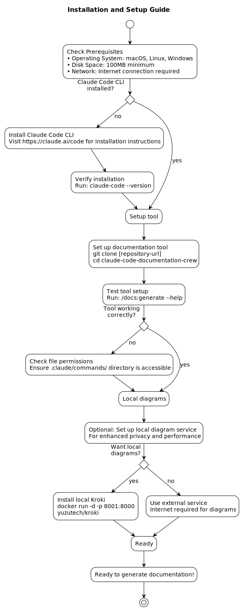
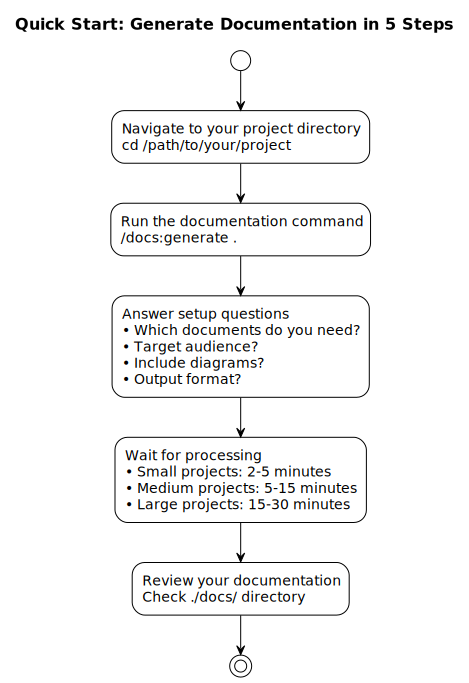
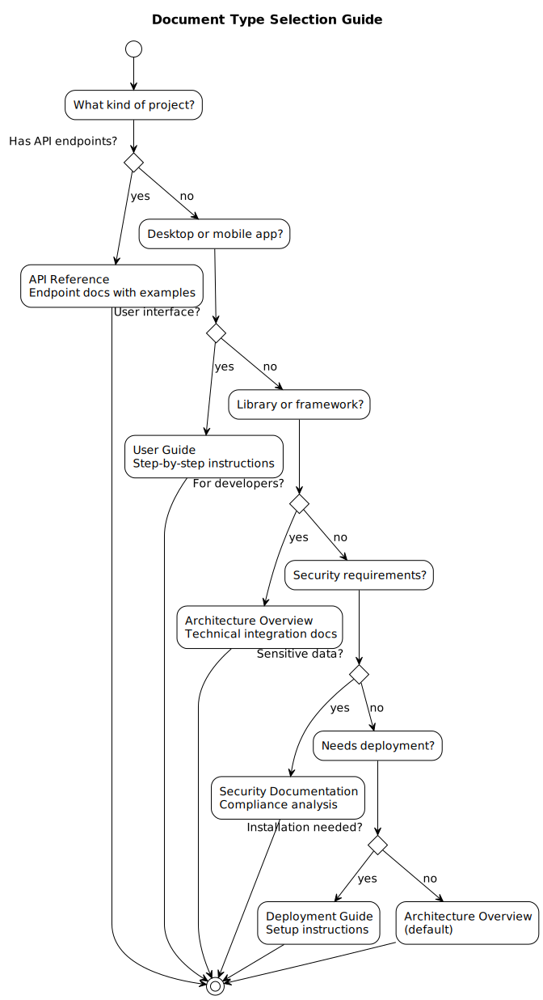
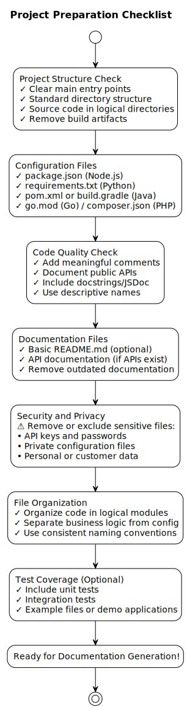

# Claude Code Documentation Crew - User Guide

> Automatically generate professional documentation for your software projects without writing it manually

## What You'll Learn

- How to install and set up the documentation tool
- Step-by-step process to generate comprehensive documentation
- Tips for preparing your project for best results
- Understanding what documentation you'll receive
- Troubleshooting common issues and getting help

## What This Tool Does for You

**Claude Code Documentation Crew** is an automated documentation generation tool that examines your code and creates professional documentation without requiring you to write it manually. Think of it as having a team of expert technical writers analyze your project and produce comprehensive documentation automatically.

### Why Use This Tool

- **Save Time**: Generate comprehensive documentation in minutes instead of days
- **Ensure Quality**: Multi-agent review system catches errors and ensures accuracy
- **Stay Current**: Documentation is always based on actual code, not outdated notes
- **Professional Results**: Enterprise-quality documentation with consistent formatting and structure

### What Documentation You Get

- **API Documentation**: Complete reference guides for your web services and APIs
- **User Guides**: Step-by-step instructions for end users of your software
- **Architecture Overviews**: Technical diagrams and system explanations for developers
- **Security Documentation**: Analysis of security features and compliance information
- **Deployment Guides**: Setup and installation instructions

### Perfect For These Situations

- **Open Source Projects**: Generate README and user documentation for GitHub repositories
- **Team Documentation**: Create internal documentation for development teams
- **API Documentation**: Produce comprehensive API references for web services
- **Client Deliverables**: Generate professional documentation for client projects
- **Compliance Requirements**: Create documentation for security audits and compliance

### When to Choose This Tool vs Alternatives

**Use Claude Code Documentation Crew when:**
- You want documentation that's guaranteed to match your actual code
- You need multiple types of documentation (API docs, user guides, architecture)
- You want professional-quality output with diagrams and formatting
- You need documentation that's reviewed for accuracy and completeness

**Consider alternatives when:**
- You need documentation for non-code assets (business processes, marketing)
- You prefer to write documentation manually for complete creative control
- Your project is very small (< 5 files) and doesn't warrant automated documentation

## Before You Begin

### Prerequisites and System Requirements

**Before You Begin:**
1. **Claude Code CLI Required**: This tool runs as a plugin for Claude Code CLI
2. **Operating System**: Works on macOS, Linux, and Windows
3. **Disk Space**: Minimum 100MB for tool installation, additional space for generated documentation
4. **Network**: Internet connection required for diagram generation (optional local setup available)

**Required Software:**
- Claude Code CLI (latest version)
- Node.js (if your project uses JavaScript/TypeScript)
- Python (if your project uses Python)
- Git (recommended for version control)

### Step-by-Step Installation



**1. Install Claude Code CLI** (if not already installed):
```bash
# Follow official Claude Code CLI installation instructions
# Available at: https://claude.ai/code
```

**2. Verify Installation**:
```bash
# Test that Claude Code CLI is working
claude-code --version
```

**3. Set Up This Documentation Tool**:
```bash
# Clone or download this documentation system
git clone [repository-url]
cd claude-code-documentation-crew
```

**4. Verify Setup**:
```bash
# Test the documentation command
/docs:generate --help
```

### Optional: Local Diagram Service Setup

**For Enhanced Privacy and Performance:**

If you want to generate diagrams locally (recommended for sensitive projects):

```bash
# Install local Kroki service using Docker
docker run -d -p 8001:8000 yuzutech/kroki

# Verify it's running
curl http://localhost:8001/health
```

**Benefits of Local Setup:**
- Faster diagram generation
- Complete privacy (no external service calls)
- Works offline
- No rate limiting

## Quick Start Guide



### Your First Documentation Generation



**Step 1: Navigate to Your Project**
```bash
# Go to the root directory of your project
cd /path/to/your/project
```

**Step 2: Run the Documentation Command**
```bash
# Basic usage - generates markdown documentation
/docs:generate .

# With options - specify output location and format
/docs:generate . --docs-location ./documentation --format markdown --diagrams
```

**Step 3: Answer the Setup Questions**
The tool will ask you a few questions to customize the documentation:

1. **"Which documents do you need?"**
   - Choose from: API Reference, User Guide, Architecture Overview, Security Documentation, Deployment Guide
   - Select all that apply to your project

2. **"Target audience?"**
   - Developers: Technical documentation with code examples
   - End users: User-friendly guides and instructions
   - Business stakeholders: High-level overviews and benefits
   - Operations team: Deployment and maintenance guides

3. **"Output documentation location?"** (Default: `{project-path}/docs`)
   - Specify where you want the documentation files created in your target project

4. **"Include diagrams?"** (Yes/No)
   - Yes: Generates visual diagrams for architecture and workflows
   - No: Text-only documentation

5. **"Document format?"** (markdown/html)
   - Markdown: Easy to edit and version control (recommended)
   - HTML: Ready for web publishing

**Step 4: Wait for Processing**
The tool will analyze your code and generate documentation. This typically takes:
- Small projects (< 50 files): 2-5 minutes
- Medium projects (50-500 files): 5-15 minutes
- Large projects (500+ files): 15-30 minutes

**Step 5: Review Your Documentation**
```bash
# Check the generated files
ls ./docs/  # (or your specified output location)

# Open the main documentation file
open ./docs/README.md  # (macOS)
# or
start ./docs/README.md  # (Windows)
```

### Common Usage Examples

**Generate API Documentation:**
```bash
/docs:generate . --docs-location ./api-docs --format markdown
# When prompted, select "API Reference" and "Developers" as audience
```

**Create User Guide:**
```bash
/docs:generate . --docs-location ./user-guide --format html --diagrams
# When prompted, select "User Guide" and "End users" as audience
```

**Full Documentation Suite:**
```bash
/docs:generate . --docs-location ./docs --format markdown --diagrams
# When prompted, select all document types
```

**Quick Documentation (No Diagrams):**
```bash
/docs:generate .
# Accept all defaults, select "Architecture Overview" for developers
```

### Understanding Command Options

**`project-path`** (required):
- `.` = Current directory
- `/path/to/project` = Specific project path
- `../other-project` = Relative path to another project

**`--docs-location`** (optional, default: `{project-path}/docs`):
- Where to place the generated documentation in your target project
- Creates directory if it doesn't exist
- Existing files may be overwritten

**`--format`** (optional, default: `markdown`):
- `markdown`: GitHub-friendly format, easy to edit
- `html`: Web-ready with navigation and styling

**`--diagrams`** (optional, default: auto-detect):
- Includes visual architecture and workflow diagrams
- Requires internet connection (unless local Kroki is set up)
- Significantly enhances documentation quality

## Preparing Your Project for Best Results



### What Makes Good Documentation Input

**Optimal Project Structure:**
```
your-project/
├── src/                    # Source code files
├── README.md              # Basic project info (optional)
├── package.json           # Dependencies and scripts (Node.js)
├── requirements.txt       # Dependencies (Python)
├── docker-compose.yml     # Deployment configuration
├── api/                   # API route definitions
└── docs/                  # Existing documentation (will be verified)
```

**Language Agnostic Documentation:**
The Documentation Crew analyzes any programming language and project structure. It intelligently adapts to your codebase regardless of technology stack, from traditional languages like C/C++ to modern frameworks and emerging technologies.

**File Types That Improve Documentation:**
- **Configuration Files**: `package.json`, `requirements.txt`, `docker-compose.yml`
- **API Definitions**: OpenAPI/Swagger specs, route files
- **Database Schemas**: Migration files, model definitions
- **Deployment Scripts**: Dockerfiles, deployment configurations
- **Test Files**: Unit tests, integration tests (show usage patterns)

### Project Size Recommendations

**Small Projects (< 50 files):**
- Perfect for quick documentation generation
- All document types recommended
- Include diagrams for better understanding

**Medium Projects (50-500 files):**
- May want to focus on specific documentation types
- Consider generating API documentation separately from user guides
- Diagrams highly recommended for architecture overview

**Large Projects (500+ files):**
- Consider documenting specific modules or services separately
- Focus on high-level architecture documentation
- May need multiple documentation generation runs for different components

**Monorepos and Microservices:**
- Run documentation generation for each service separately
- Use clear naming for output directories
- Consider creating an index document linking all service documentation

### Files to Exclude or Ignore

**The tool automatically ignores:**
- `node_modules/` and similar dependency directories
- `.git/` version control files
- Build artifacts and compiled files
- Temporary and cache files

**You should consider excluding:**
- Sensitive configuration files with passwords or API keys
- Large data files or binary assets
- Generated code that shouldn't be documented
- Legacy code that's being deprecated

### Code Comments for Better Documentation

**While not required, good comments help:**

**API Endpoints:**
```javascript
/**
 * Create a new user account
 * @param {string} email - User's email address
 * @param {string} password - User's password (8+ characters)
 * @returns {object} User object with authentication token
 */
app.post('/api/users', createUser);
```

**Function Documentation:**
```python
def calculate_total(items, tax_rate=0.08):
    """
    Calculate total price including tax.
    
    Args:
        items (list): List of item dictionaries with 'price' keys
        tax_rate (float): Tax rate as decimal (default: 0.08 for 8%)
    
    Returns:
        float: Total price including tax
    """
```

**Configuration Explanations:**
```yaml
# docker-compose.yml
services:
  web:
    # Main application server
    build: .
    ports:
      - "3000:3000"  # Maps host port 3000 to container port 3000
```

## What to Expect - Documentation Outputs

### What Files You'll Get

**Basic Documentation Generation:**
```
docs/
├── README.md              # Main project documentation
├── API-Reference.md       # API endpoints and usage (if APIs found)
├── User-Guide.md         # End-user instructions (if requested)
├── Architecture-Overview.md  # System design and structure
└── assets/               # Generated diagrams (if requested)
    ├── system-overview.svg
    ├── api-workflow.svg
    └── deployment-diagram.svg
```

**With Full Options:**
```
docs/
├── README.md              # Project overview and getting started
├── API-Reference.md       # Complete API documentation
├── User-Guide.md         # Step-by-step user instructions
├── Architecture-Overview.md  # Technical system design
├── Security-Documentation.md  # Security features and considerations
├── Deployment-Guide.md    # Installation and deployment
└── assets/               # Visual diagrams
    ├── component-diagram.svg      # System components
    ├── sequence-diagram.svg       # User interaction flows
    ├── deployment-diagram.svg     # Infrastructure setup
    └── network-diagram.svg        # System connections
```

### Quality Indicators for Good Results

**✅ Signs of Successful Documentation:**
- **Complete File Structure**: All requested document types are generated
- **Substantive Content**: Each file contains multiple sections with detailed information
- **Code References**: Documentation includes specific file paths and code examples
- **Accurate Information**: Technical details match your actual code implementation
- **Clear Structure**: Table of contents, section headers, and logical organization

**⚠️ Signs That May Need Review:**
- **Very Short Files**: Documentation files under 1KB may indicate insufficient analysis
- **Generic Content**: Documentation that could apply to any project (lacks specifics)
- **Missing Diagrams**: If you requested diagrams but the assets/ folder is empty
- **Placeholder Text**: Content with "TODO" or "PLACEHOLDER" markers

**❌ Signs of Issues:**
- **Empty Files**: Generated files with no content
- **Error Messages**: Files containing error messages instead of documentation
- **Contradictory Information**: Documentation that contradicts itself
- **Broken References**: Links to files or sections that don't exist

### File Size and Content Expectations

**Typical File Sizes for Medium Projects:**
- **README.md**: 5-15KB (comprehensive project overview)
- **API-Reference.md**: 10-50KB (depending on number of endpoints)
- **User-Guide.md**: 8-25KB (step-by-step instructions)
- **Architecture-Overview.md**: 15-40KB (detailed technical design)
- **Diagrams**: 10-100KB each (SVG format)

**Content Volume Indicators:**
- **Small Project**: 3-5 documentation files, 50-200KB total
- **Medium Project**: 5-8 documentation files, 200-800KB total
- **Large Project**: 6-10 documentation files, 500KB-2MB total

### Timeline Expectations

**Processing Time by Project Size:**

**Small Projects (< 50 files):**
- Analysis Phase: 30-60 seconds
- Documentation Generation: 1-2 minutes
- Diagram Creation: 30-60 seconds
- **Total**: 2-4 minutes

**Medium Projects (50-500 files):**
- Analysis Phase: 2-5 minutes
- Documentation Generation: 3-8 minutes
- Diagram Creation: 1-3 minutes
- **Total**: 6-16 minutes

**Large Projects (500+ files):**
- Analysis Phase: 5-15 minutes
- Documentation Generation: 8-20 minutes
- Diagram Creation: 2-5 minutes
- **Total**: 15-40 minutes

**Factors That Affect Processing Time:**
- **Code Complexity**: More complex projects take longer to analyze
- **Number of Files**: Linear relationship with processing time
- **API Endpoints**: Projects with many APIs require additional analysis
- **Documentation Types**: More document types = longer processing
- **Diagram Generation**: Adds 20-30% to total time
- **Network Speed**: Affects external diagram service calls

### Progress Indicators

**What You'll See During Processing:**
1. **"Setting up workspace..."** - Creating temporary files and directories
2. **"Analyzing codebase..."** - Examining your source code
3. **"Generating specialized analysis..."** - API and security analysis (if applicable)
4. **"Creating documentation..."** - Writing the actual documentation
5. **"Generating diagrams..."** - Creating visual diagrams (if requested)
6. **"Final quality review..."** - Checking documentation quality
7. **"Documentation complete!"** - Process finished

**If Processing Seems Stuck:**
- **Wait at least 5 minutes** before concluding there's an issue
- **Check for error messages** in the console output
- **Verify internet connection** if diagrams are being generated
- **Cancel and retry** if no progress for > 10 minutes on small projects

## Troubleshooting Common Issues

#### "Command not found: /docs:generate"

**Problem**: The documentation tool isn't properly installed or accessible.

**Solutions:**
1. **Verify Claude Code CLI Installation**:
   ```bash
   claude-code --version
   ```
   If this fails, reinstall Claude Code CLI.

2. **Check Tool Installation**:
   ```bash
   cd /path/to/claude-code-documentation-crew
   ls .claude/commands/docs/
   ```
   Should show `generate.md` file.

3. **Run from Correct Directory**:
   ```bash
   # Make sure you're in the documentation tool directory
   pwd
   # Should show path ending in 'claude-code-documentation-crew'
   ```

#### "No code found to analyze"

**Problem**: The tool can't find source code in your project.

**Solutions:**
1. **Check Project Path**:
   ```bash
   # Verify you're pointing to the right directory
   ls /path/to/your/project
   # Should show source files like .js, .py, .java, etc.
   ```

2. **Verify File Types**:
   - Ensure your project contains actual source code files
   - Common extensions: `.js`, `.ts`, `.py`, `.java`, `.go`, `.php`, `.rb`, `.cs`

3. **Check Directory Structure**:
   ```bash
   # Look for source directories
   find . -name "*.js" -o -name "*.py" -o -name "*.java" | head -10
   ```

#### "Documentation files are empty or very short"

**Problem**: Generated documentation lacks substance.

**Solutions:**
1. **Add Code Comments**: Improve your source code with descriptive comments
2. **Check Configuration Files**: Ensure `package.json`, `requirements.txt`, etc. exist
3. **Verify Project Structure**: Organize code in logical directories
4. **Try Different Document Types**: Some projects work better with API Reference vs User Guide

#### "Diagrams missing or not generated"

**Problem**: Requested diagrams but they weren't created.

**Solutions:**
1. **Check Internet Connection**:
   ```bash
   # Test external diagram service
   curl -I https://kroki.io/health
   ```

2. **Install Local Kroki** (recommended):
   ```bash
   docker run -d -p 8001:8000 yuzutech/kroki
   ```

3. **Retry Without Diagrams**:
   ```bash
   /docs:generate . --format markdown
   # Don't select diagrams option when prompted
   ```

#### "Process takes too long or seems stuck"

**Problem**: Documentation generation is taking much longer than expected.

**Solutions:**
1. **For Large Projects**: Be patient, 30+ minutes is normal for 1000+ files
2. **Check Resource Usage**: Close other applications to free up memory
3. **Try Smaller Scope**:
   ```bash
   # Document specific subdirectory
   /docs:generate ./src --docs-location ./docs
   ```

4. **Restart and Retry**:
   ```bash
   # Cancel current process (Ctrl+C) and restart
   /docs:generate . --format markdown
   ```

#### "Documentation contains errors or inaccuracies"

**Problem**: Generated documentation doesn't match your actual code.

**Solutions:**
1. **Update Comments**: Add or improve code comments and documentation
2. **Check File Organization**: Ensure main entry points are clearly identifiable
3. **Review Configuration**: Make sure `package.json`, `README.md` are up to date
4. **Regenerate Specific Sections**: Focus on one document type at a time

### When to Seek Help vs Retry

**Try Again Yourself When:**
- Error messages mention missing files or directories
- Process completes but results are shorter than expected
- Diagrams are missing (usually internet/service issue)
- First time using the tool (may need practice)

**Seek Technical Help When:**
- Consistent crashes or system errors
- Tool completely fails to run after proper installation
- Generated documentation is completely wrong or nonsensical
- Error messages mention system-level issues

**Information to Gather for Support:**
1. **Your Operating System**: macOS/Windows/Linux version
2. **Project Details**: Programming language, approximate size, structure
3. **Full Command Used**: Exact command and options you ran
4. **Error Messages**: Complete error output (copy and paste)
5. **Expected vs Actual**: What you expected and what you got instead

### Warning Messages You Can Safely Ignore

**"Using external service for diagram generation"**
- Normal when local Kroki service isn't installed
- Diagrams will still be generated correctly

**"Some specialist analysis skipped"**
- Normal when your project doesn't have APIs or special security features
- Documentation will still be complete for your project type

**"Large project detected, this may take longer"**
- Just an information message about expected processing time
- No action needed

### Warning Messages That Require Action

**"Sensitive information detected in code"**
- Review generated documentation before sharing
- Consider excluding sensitive files from documentation

**"External service unreachable"**
- Internet connection issue affecting diagram generation
- Install local Kroki service or retry later

**"Project structure unclear"**
- May need to improve project organization
- Add main entry point files or configuration files

## Performance and Optimization

### Realistic Performance Expectations

**Processing Speed by Project Characteristics:**

**Language and Framework Impact:**
- **JavaScript/Node.js**: Fastest analysis (simple project structure)
- **Python**: Fast analysis (clear module structure)
- **Java/Spring**: Moderate speed (complex frameworks)
- **Monorepos**: Slower (multiple project analysis)

**File Count Guidelines:**
- **< 50 files**: 2-5 minutes total
- **50-200 files**: 5-12 minutes total
- **200-500 files**: 12-25 minutes total
- **500-1000 files**: 25-45 minutes total
- **1000+ files**: 45+ minutes (consider breaking into smaller parts)

**Memory Usage:**
- **Typical Usage**: 500MB-2GB RAM during processing
- **Large Projects**: Up to 4GB RAM for very large codebases
- **Concurrent Operations**: Multiple agents running simultaneously

### Optimization Tips for Better Performance

**Project Organization:**
1. **Clear Entry Points**: Have obvious main files (`index.js`, `main.py`, `app.js`)
2. **Standard Structure**: Follow common conventions for your language/framework
3. **Configuration Files**: Include `package.json`, `requirements.txt`, etc.
4. **Exclude Build Artifacts**: Remove `node_modules`, `build/`, `dist/` directories

**For Faster Processing:**
1. **Document Specific Areas**:
   ```bash
   # Document just the API layer
   /docs:generate ./api --docs-location ./api-docs
   ```

2. **Skip Diagrams for Speed**:
   ```bash
   /docs:generate . --format markdown
   # Select "No" for diagrams
   ```

3. **Use Local Services**:
   ```bash
   # Install local Kroki to avoid network delays
   docker run -d -p 8001:8000 yuzutech/kroki
   ```

**System-Level Optimizations:**
1. **Close Other Applications**: Free up RAM and CPU
2. **Use SSD Storage**: Faster file I/O improves processing speed
3. **Stable Internet**: Required for external diagram generation
4. **Modern Hardware**: 8GB+ RAM recommended for large projects

### Resource Requirements and Limits

**Minimum System Requirements:**
- **RAM**: 4GB (8GB recommended for large projects)
- **Storage**: 1GB free space
- **CPU**: Any modern processor (multi-core preferred)
- **Network**: Stable internet for diagram generation

**Project Size Limits:**
- **Recommended Maximum**: 2000 files
- **Absolute Maximum**: 5000 files (may require system optimization)
- **File Size Limit**: Individual files up to 1MB (larger files may be skipped)

**Output Size Expectations:**
- **Documentation**: 1-5MB total
- **Diagrams**: 100KB-1MB per diagram
- **Temporary Files**: 10-50MB during processing (automatically cleaned)

**Scaling for Very Large Projects:**
1. **Break Into Modules**: Document each major component separately
2. **Use Selective Analysis**: Focus on public APIs and user-facing features
3. **Parallel Processing**: Document different modules on different machines
4. **Archive Old Versions**: Remove deprecated code before documentation

### Progress Monitoring and Expectations

**Normal Processing Phases:**
1. **Setup** (30 seconds): Creating workspace and configuration
2. **Analysis** (40-60% of total time): Code examination and pattern detection
3. **Specialist Review** (10-20% of total time): API and security analysis
4. **Writing** (20-30% of total time): Documentation generation
5. **Diagrams** (10-20% of total time): Visual generation (if requested)
6. **Quality Review** (5-10% of total time): Final validation

**Signs of Normal Progress:**
- **Steady Output**: Regular status messages every 30-60 seconds
- **File Creation**: Temporary files appearing in `.ccdocs` directory
- **Memory Usage**: Gradual increase in RAM usage
- **CPU Activity**: Consistent processor activity

**Signs of Problems:**
- **No Output**: No status messages for > 5 minutes
- **Memory Explosion**: RAM usage exceeding system capacity
- **Error Loops**: Repeated error messages
- **No File Creation**: No temporary files after 10+ minutes

### Optimization for Different Use Cases

**Quick Documentation (Speed Priority):**
```bash
/docs:generate . --format markdown --docs-location ./quick-docs
# Select only "Architecture Overview" for "Developers"
# Skip diagrams
# Expected time: 50% faster than full documentation
```

**Comprehensive Documentation (Quality Priority):**
```bash
/docs:generate . --format markdown --diagrams --docs-location ./docs
# Select all document types
# Include diagrams
# Accept longer processing time for complete results
```

**API-Only Documentation:**
```bash
/docs:generate . --format markdown --docs-location ./api-docs
# Select only "API Reference" for "Developers"
# Include diagrams for API workflows
# Fastest for projects with clear API structure
```

**Client-Ready Documentation:**
```bash
/docs:generate . --format html --diagrams --docs-location ./client-docs
# Select "User Guide" and "Architecture Overview"
# Target audience: "Business stakeholders"
# Include professional diagrams
# Allow extra time for HTML formatting
```

## Next Steps and Advanced Usage

### After Your First Documentation Generation

**1. Review and Customize**:
- Read through all generated documentation files
- Check that the content accurately reflects your project
- Make note of any missing information or inaccuracies

**2. Version Control Integration**:
```bash
# Add documentation to your repository
git add docs/
git commit -m "Add auto-generated documentation"
git push
```

**3. Keep Documentation Updated**:
```bash
# Regenerate documentation after significant code changes
/docs:generate . --docs-location ./docs --format markdown --diagrams
```

**4. Share with Your Team**:
- Include documentation links in your project README
- Share specific guides (User Guide, API Reference) with relevant stakeholders
- Use HTML format for internal wikis or websites

### Advanced Configuration Tips

**For Different Project Types:**

**Open Source Projects:**
- Focus on User Guide and README generation
- Include diagrams for better understanding
- Use markdown format for GitHub compatibility

**API Services:**
- Prioritize API Reference documentation
- Include sequence diagrams for workflows
- Generate separate documentation for different API versions

**Enterprise Applications:**
- Include Security Documentation for compliance
- Generate Deployment Guides for operations teams

**Microservices:**
- Document each service separately
- Create architecture overviews showing service relationships
- Include network diagrams for service communication

### Integration with Development Workflow

**Continuous Integration:**
Consider adding documentation generation to your CI/CD pipeline:

```bash
# Example CI script
/docs:generate . --docs-location ./docs --format markdown
git add docs/
git commit -m "Update documentation [skip ci]"
```

**Documentation Reviews:**
- Review generated documentation as part of code reviews
- Ensure new features are properly reflected in documentation
- Update documentation when APIs or user interfaces change

**Team Onboarding:**
- Use generated documentation for new team member onboarding
- Include User Guides in customer support materials
- Share Architecture Overviews in technical design reviews

## Getting Help and Support

### Community and Resources

**Documentation and Examples:**
- Check the project repository for example outputs
- Review generated documentation from similar projects
- Consult the technical documentation for advanced configuration

**Best Practices:**
- Follow standard project organization for your programming language
- Include clear comments and documentation strings in your code
- Maintain up-to-date configuration files (`package.json`, `requirements.txt`, etc.)

**Community Support:**
- Search existing issues for similar problems
- Provide detailed information when reporting issues
- Share successful configurations with the community

### Continuous Improvement

**Make Your Documentation Better:**
1. **Improve Code Organization**: Well-organized code produces better documentation
2. **Add Meaningful Comments**: Descriptive comments enhance generated documentation
3. **Maintain Configuration Files**: Keep dependency files and project metadata current
4. **Review and Iterate**: Regularly regenerate documentation as your project evolves

**Feedback and Suggestions:**
- Report inaccuracies in generated documentation
- Suggest improvements for better automation
- Share examples of particularly successful documentation generation

This comprehensive User Guide provides everything you need to successfully use the Claude Code Documentation Crew tool to generate professional documentation for your software projects. The tool's automated multi-agent system ensures high-quality, accurate documentation that saves you time while maintaining professional standards.